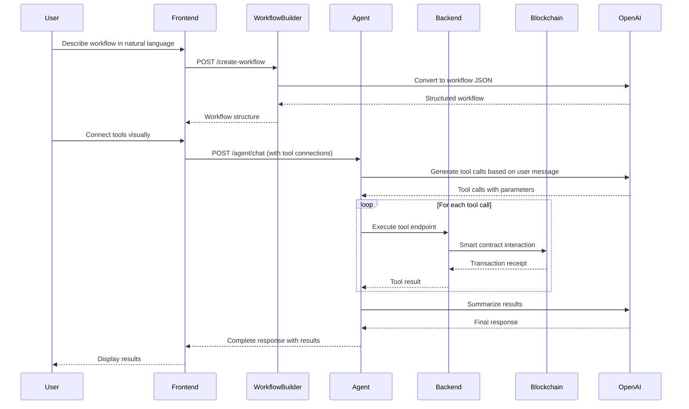
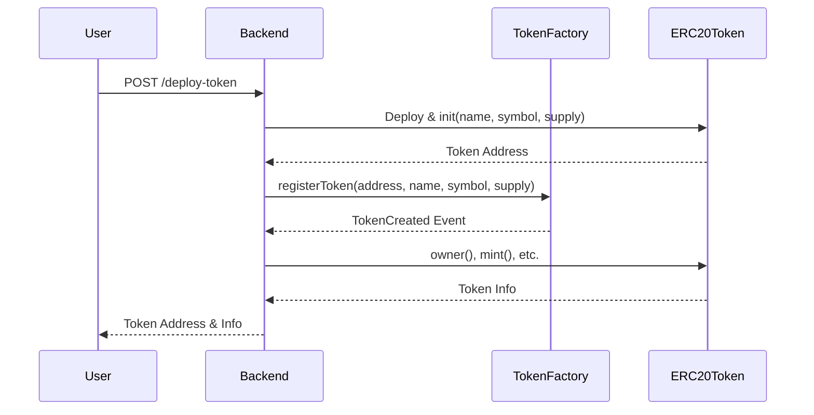
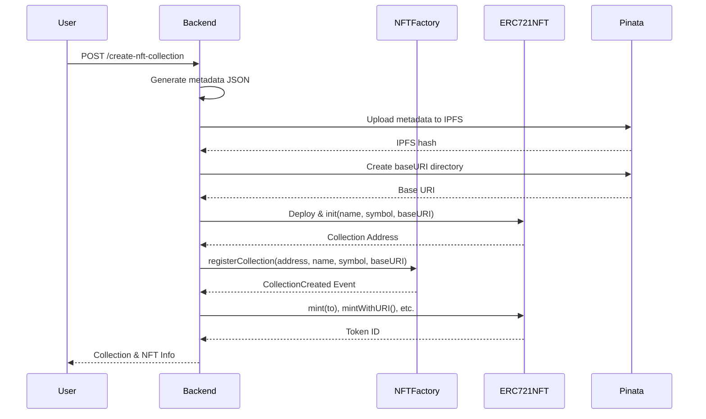
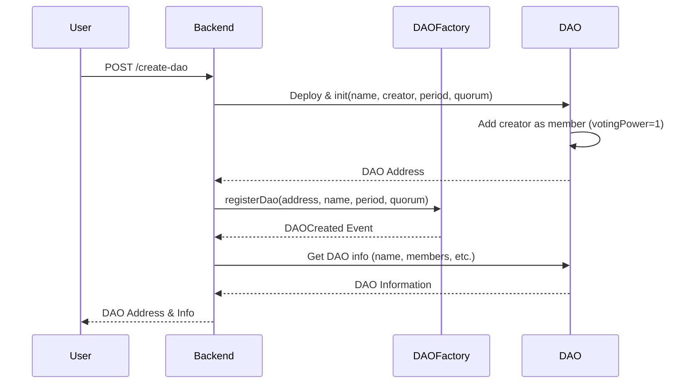
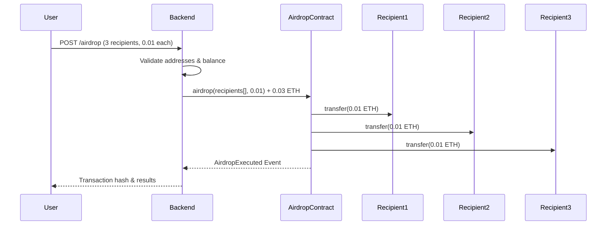
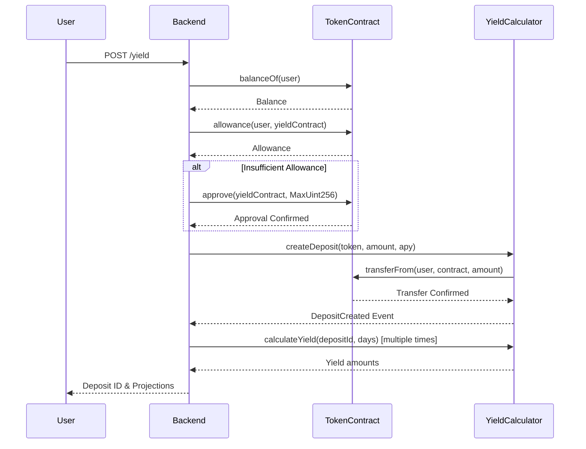
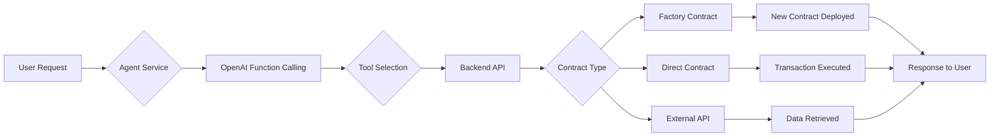
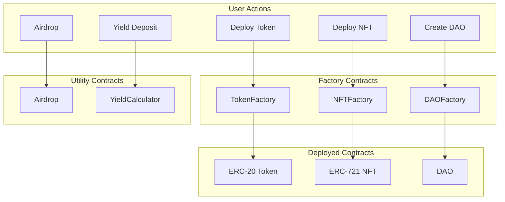

# Arbitrum No-Code Agent Builder

## Introduction

**Arbitrum No-Code Agent Builder** is a no-code platform that enables users to build, deploy, and interact with AI-powered blockchain agents on the Arbitrum Sepolia testnet. The platform provides a visual workflow builder interface where users can create sophisticated blockchain automation workflows without writing code.

The platform supports 10 blockchain tools including **token transfers, swaps, token/NFT deployment, DAO creation, airdrops, yield calculations, price fetching, and wallet analytics**. All tools interact with smart contracts deployed on the Arbitrum Sepolia testnet. The contracts are implemented using **Arbitrum Stylus**, allowing them to be written in Rust and compiled to WebAssembly for enhanced performance and gas efficiency.

## Resources

* **Pitch Deck** : [View Here](https://www.canva.com/design/DAG31cRK5wY/FolpicleXo_Cw4IrpTAKAQ/view?utm_content=DAG31cRK5wY&utm_campaign=designshare&utm_medium=link2&utm_source=uniquelinks&utlId=h90251dbeda#1)
* **Demo Video** : [View Here](https://youtu.be/jbIAx5w-S90)
* **Live Demo** : [View Here](https://stylus-agent-builder.vercel.app)
  
### Deployed Tool Contracts

All smart contracts are deployed on the **Arbitrum Sepolia testnet** using **Arbitrum Stylus** (Rust/WASM). View them on the Explorer:

| Contract | Address | Explorer Link | Contract Code | Test Script |
|----------|---------|---------------|---------------|-------------|
| **TokenFactory** | `0xed088fd93517b0d0c3a3e4d2e2c419fb58570556` | [View on Explorer](https://sepolia.arbiscan.io/address/0xed088fd93517b0d0c3a3e4d2e2c419fb58570556) | [token-factory/src/lib.rs](backend/arbitrum-stylus-contracts/token-factory/src/lib.rs) | [test.js](backend/arbitrum-stylus-contracts/token-factory/test.js) |
| **ERC-20 Token** | `0x473200e631dc83fdf6a8c48eb9e44414a90cec50` | [View on Explorer](https://sepolia.arbiscan.io/address/0x473200e631dc83fdf6a8c48eb9e44414a90cec50) | [erc20-token/src/lib.rs](backend/arbitrum-stylus-contracts/erc20-token/src/lib.rs) | [test.js](backend/arbitrum-stylus-contracts/erc20-token/test.js) |
| **NFTFactory** | `0xbeaf33e277499dbb7982061d261c6c286494855e` | [View on Explorer](https://sepolia.arbiscan.io/address/0xbeaf33e277499dbb7982061d261c6c286494855e) | [nft-factory/src/lib.rs](backend/arbitrum-stylus-contracts/nft-factory/src/lib.rs) | [test.js](backend/arbitrum-stylus-contracts/nft-factory/test.js) |
| **ERC-721 NFT** | `0x74e3bace8102f7d2bb5741ac301e6b062d5224b9` | [View on Explorer](https://sepolia.arbiscan.io/address/0x74e3bace8102f7d2bb5741ac301e6b062d5224b9) | [erc721-nft/src/lib.rs](backend/arbitrum-stylus-contracts/erc721-nft/src/lib.rs) | [test.js](backend/arbitrum-stylus-contracts/erc721-nft/test.js) |
| **DAOFactory** | `0xf4242a5bebdd12abc7d01ab9fd3f7473b3295d46` | [View on Explorer](https://sepolia.arbiscan.io/address/0xf4242a5bebdd12abc7d01ab9fd3f7473b3295d46) | [dao-factory/src/lib.rs](backend/arbitrum-stylus-contracts/dao-factory/src/lib.rs) | [test.js](backend/arbitrum-stylus-contracts/dao-factory/test.js) |
| **DAO** | `0x95d7bc3f2f8172298c2487dfeca23d86b09572f5` | [View on Explorer](https://sepolia.arbiscan.io/address/0x95d7bc3f2f8172298c2487dfeca23d86b09572f5) | [dao/src/lib.rs](backend/arbitrum-stylus-contracts/dao/src/lib.rs) | [test.js](backend/arbitrum-stylus-contracts/dao/test.js) |
| **Airdrop** | `0x6239a115e23a11033930c1892eb6b67649c12f18` | [View on Explorer](https://sepolia.arbiscan.io/address/0x6239a115e23a11033930c1892eb6b67649c12f18) | [airdrop/src/lib.rs](backend/arbitrum-stylus-contracts/airdrop/src/lib.rs) | [test.js](backend/arbitrum-stylus-contracts/airdrop/test.js) |
| **YieldCalculator** | `0x70f749501b44ea186550dfca4e9f87a5d120bb4d` | [View on Explorer](https://sepolia.arbiscan.io/address/0x70f749501b44ea186550dfca4e9f87a5d120bb4d) | [yield-calculator/src/lib.rs](backend/arbitrum-stylus-contracts/yield-calculator/src/lib.rs) | [test.js](backend/arbitrum-stylus-contracts/yield-calculator/test.js) |

**Note:** All contracts are implemented in Rust using the Arbitrum Stylus SDK (v0.6.0) and compiled to WebAssembly. They are cached in ArbOS for cheaper execution costs. See [deployment-config.json](backend/arbitrum-stylus-contracts/deployment-config.json) for complete deployment details.

---

## How to Use

Getting started with Arbitrum No-Code Agent Builder is simple! Follow these steps:

1. **Visit** [https://stylus-agent-builder.vercel.app](https://stylus-agent-builder.vercel.app)
2. **Get Started** with just a Google sign in.
3. **Create an Agent Wallet** or Import your own wallet from private key (ensure you have ETH on Arbitrum Sepolia).
   
   

4. **Create Your First Agent** by just drag-dropping the tools you need!
   
   

5. **You Can Also AI Generate Your Agent!** just ask our AI to generate your agent with the right tools.
   
   

6. **Save your agent**.

   

7. **Interact with it** in the UI or with curl requests by using your api key.
   
   

   

That's it! You've created your first Arbitrum agent without any programming knowledge, as simple as that!

---

## Table of Contents

1. [Platform Architecture](#platform-architecture)
2. [System Components](#system-components)
   - [Frontend](#frontend)
   - [Backend API](#backend-api)
   - [Agent Service](#agent-service)
   - [Workflow Builder](#workflow-builder)
3. [Blockchain Tools](#blockchain-tools)
   - [Transfer Tool](#1-transfer-tool)
   - [Swap Tool](#2-swap-tool)
   - [Balance Fetch Tool](#3-balance-fetch-tool)
   - [ERC-20 Token Deployment](#4-erc-20-token-deployment)
   - [ERC-721 NFT Collection Deployment](#5-erc-721-nft-collection-deployment)
   - [DAO Creation](#6-dao-creation)
   - [Airdrop Tool](#7-airdrop-tool)
   - [Token Price Fetching](#8-token-price-fetching)
   - [Yield Calculator](#9-yield-calculator)
   - [Wallet Analytics](#10-wallet-analytics)
4. [Smart Contract Implementations](#smart-contract-implementations)
   - [TokenFactory & MyToken](#tokenfactory--mytoken)
   - [NFTFactory & MyNFT](#nftfactory--mynft)
   - [DAOFactory & DAO](#daofactory--dao)
   - [Airdrop Contract](#airdrop-contract)
   - [YieldCalculator Contract](#yieldcalculator-contract)

---

## Platform Architecture

### High-Level Architecture Diagram

```mermaid
graph TB
    subgraph "User Interface Layer"
        UI[Frontend - Next.js<br/>Visual Workflow Builder]
    end
    
    subgraph "AI Services Layer"
        Agent[Agent Service<br/>FastAPI<br/>AI Agent Orchestration]
        WBuilder[Workflow Builder<br/>FastAPI<br/>Natural Language Processing]
    end
    
    subgraph "API Layer"
        Backend[Backend API<br/>Express.js<br/>Blockchain Operations]
    end
    
    subgraph "Blockchain Layer - Arbitrum Sepolia"
        TokenFactory[TokenFactory Contract<br/>0xed088fd93517b0d0c3a3e4d2e2c419fb58570556]
        ERC20Token[ERC-20 Token<br/>0x473200e631dc83fdf6a8c48eb9e44414a90cec50]
        NFTFactory[NFTFactory Contract<br/>0xbeaf33e277499dbb7982061d261c6c286494855e]
        ERC721NFT[ERC-721 NFT<br/>0x74e3bace8102f7d2bb5741ac301e6b062d5224b9]
        DAOFactory[DAOFactory Contract<br/>0xf4242a5bebdd12abc7d01ab9fd3f7473b3295d46]
        DAO[DAO Contract<br/>0x95d7bc3f2f8172298c2487dfeca23d86b09572f5]
        Airdrop[Airdrop Contract<br/>0x6239a115e23a11033930c1892eb6b67649c12f18]
        YieldCalc[YieldCalculator Contract<br/>0x70f749501b44ea186550dfca4e9f87a5d120bb4d]
        SwapRouter[Swap Router<br/>Uniswap Compatible]
        ArbitrumAPI[Arbitrum APIs<br/>Token Balance Queries]
    end
    
    subgraph "External Services"
        OpenAI[OpenAI API<br/>GPT-4o / GPT-4o-search]
        IPFS[Pinata IPFS<br/>NFT Metadata Storage]
    end
    
    UI -->|HTTP Requests| Agent
    UI -->|HTTP Requests| WBuilder
    Agent -->|HTTP Requests| Backend
    WBuilder -->|HTTP Requests| Backend
    Backend -->|RPC Calls| TokenFactory
    Backend -->|RPC Calls| NFTFactory
    Backend -->|RPC Calls| DAOFactory
    Backend -->|RPC Calls| Airdrop
    Backend -->|RPC Calls| YieldCalc
    Backend -->|RPC Calls| SwapRouter
    Backend -->|HTTP Requests| ArbitrumAPI
    Agent -->|API Calls| OpenAI
    Backend -->|API Calls| IPFS
    Backend -->|API Calls| OpenAI
```



### Data Flow Diagram



---

## System Components

### Frontend

**Technology Stack:**
- Next.js 15 (React 19)
- TypeScript
- React Flow (visual workflow builder)
- Tailwind CSS
- Radix UI components

**Key Features:**
- Visual drag-and-drop workflow builder
- Node-based tool configuration
- Real-time AI chat interface
- Workflow saving and loading
- Agent management dashboard

**Main Components:**
- `workflow-builder.tsx` - Main workflow canvas with React Flow
- `node-library.tsx` - Tool palette for dragging tools onto canvas
- `node-config-panel.tsx` - Configuration panel for selected nodes
- `ai-chat-modal.tsx` - Chat interface for interacting with agents
- Custom node types: Input, Output, Process, Conditional, Code

### Backend API

**Technology Stack:**
- Express.js
- ethers.js v6
- Solidity compiler (solc)
- Axios for HTTP requests
- OpenAI SDK

**Network:**
- Arbitrum Sepolia RPC: `https://sepolia-rollup.arbitrum.io/rpc`
- Explorer: `https://sepolia.arbiscan.io`
- Chain ID: `421614`

**Key Responsibilities:**
- Blockchain interaction via ethers.js
- Smart contract deployment and interaction
- Token/NFT/DAO creation via factory contracts
- IPFS metadata upload for NFTs
- Token price fetching via OpenAI search
- Wallet balance queries via Arbitrum APIs

**Port:** 3000 (default)

### Agent Service

**Technology Stack:**
- FastAPI
- OpenAI GPT-4o
- Python requests library

**Key Features:**
- Dynamic tool configuration based on workflow
- Sequential tool execution support
- Function calling with OpenAI
- Context-aware tool selection
- Private key management for transactions

**Endpoints:**
- `POST /agent/chat` - Main chat endpoint with tool execution
- `GET /tools` - List all available tools
- `GET /health` - Health check

**Port:** 8000 (default)

### Workflow Builder

**Technology Stack:**
- FastAPI
- OpenAI GPT-4o-2024-08-06 (structured outputs)

**Key Features:**
- Natural language to workflow conversion
- Structured JSON output with tool connections
- Sequential execution detection
- Tool type validation

**Endpoints:**
- `POST /create-workflow` - Convert natural language to workflow
- `GET /available-tools` - List available tools
- `GET /health` - Health check

**Port:** 8000 (default, different from agent service in production)

---

## Blockchain Tools

### 1. Transfer Tool

**Endpoint:** `POST /transfer`

**Description:**
Transfers native ETH tokens or ERC-20 tokens from one wallet to another on Arbitrum Sepolia. Supports both native token transfers and ERC-20 token transfers.

**Request Body:**
```json
{
  "privateKey": "0x...",
  "toAddress": "0x...",
  "amount": "0.01",
  "tokenAddress": "0x..." // Optional: if provided, transfers ERC-20 tokens
}
```

**Implementation Details:**

**For Native Token Transfer (ETH):**
1. Validates wallet balance
2. Creates transaction with `ethers.parseEther(amount)`
3. Sends transaction via `wallet.sendTransaction()`
4. Waits for confirmation
5. Returns transaction hash and explorer link

**For ERC-20 Token Transfer:**
1. Connects to token contract using ERC-20 ABI
2. Fetches token decimals
3. Parses amount with proper decimals: `ethers.parseUnits(amount, decimals)`
4. Checks token balance using `balanceOf()`
5. Calls `transfer()` function on token contract
6. Waits for transaction confirmation
7. Returns token info, transaction hash, and explorer link

**Response:**
```json
{
  "success": true,
  "type": "native" | "ERC20",
  "transactionHash": "0x...",
  "from": "0x...",
  "to": "0x...",
  "amount": "0.01",
  "blockNumber": 217915266,
  "gasUsed": "421000",
  "explorerUrl": "https://sepolia.arbiscan.io/tx/..."
}
```

**Contract Interaction:**
- Uses standard ERC-20 interface: `transfer(address to, uint256 amount)`
- No smart contract deployment needed (uses existing token contracts)

**Example:**
- See test script: [erc20-token/test.js](backend/arbitrum-stylus-contracts/erc20-token/test.js) for transfer examples

---

### 2. Swap Tool

**Endpoint:** `POST /swap`

**Description:**
Swaps one ERC-20 token for another using Uniswap V2/V3 compatible router on Arbitrum Sepolia.

**Request Body:**
```json
{
  "privateKey": "0x...",
  "tokenIn": "0x...",
  "tokenOut": "0x...",
  "amountIn": "10",
  "slippageTolerance": 3,
  "poolFee": 500,
  "routerType": "uniswap_v3"
}
```

**Implementation Details:**

1. **Token Approval:**
   - Checks current allowance
   - If insufficient, calls `approve()` on tokenIn contract
   - Approves swap router address: `0x6aac14f090a35eea150705f72d90e4cdc4a49b2c`

2. **Amount Calculation:**
   - Parses input amount with token decimals
   - Calculates minimum output: `amountIn * (100 - slippageTolerance) / 100`
   - Parses output amount with output token decimals

3. **Swap Execution:**
   - **Uniswap V3:** Uses `exactInputSingle()` with pool fee
   - **Uniswap V2:** Uses `swapExactTokensForTokens()` with deadline
   - Estimates gas and adds 50% buffer
   - Executes swap transaction

4. **Transaction Confirmation:**
   - Waits for transaction receipt
   - Returns approval and swap transaction hashes

**Response:**
```json
{
  "success": true,
  "wallet": "0x...",
  "tokenIn": "0x...",
  "tokenOut": "0x...",
  "amountIn": "10",
  "slippageTolerance": 3,
  "routerType": "uniswap_v3",
  "approveTxHash": "0x...",
  "swapTxHash": "0x...",
  "blockNumber": 218000000,
  "gasUsed": "150000",
  "explorerUrl": "https://sepolia.arbiscan.io/tx/..."
}
```

**Contract Interaction:**
- **Swap Router:** Uniswap V2/V3 compatible router on Arbitrum Sepolia
- **Uniswap V3 Router ABI:** `exactInputSingle((address,address,uint24,address,uint256,uint256,uint160))`
- **Uniswap V2 Router ABI:** `swapExactTokensForTokens(uint256,uint256,address[],address,uint256)`

---

### 3. Balance Fetch Tool

**Endpoint:** `GET /balance/:address` or `GET /balance/:address/:token`

**Description:**
Fetches native ETH balance or ERC-20 token balance for a wallet address on Arbitrum Sepolia.

**Implementation Details:**

**Native Balance:**
1. Uses `provider.getBalance(address)`
2. Formats using `ethers.formatEther()`
3. Returns balance in ETH and wei

**ERC-20 Balance:**
1. Connects to token contract
2. Calls `balanceOf(address)`
3. Fetches `decimals()`, `symbol()`, `name()`
4. Formats balance using `ethers.formatUnits(balance, decimals)`
5. Returns token info and balance

**Response:**
```json
{
  "address": "0x...",
  "token": "0x...",
  "name": "Token Name",
  "symbol": "TKN",
  "balance": "1000.0",
  "balanceWei": "1000000000000000000000",
  "decimals": 18
}
```

**Contract Interaction:**
- Standard ERC-20 interface: `balanceOf(address)`, `decimals()`, `symbol()`, `name()`

---

### 4. ERC-20 Token Deployment

**Endpoint:** `POST /deploy-token`

**Description:**
Deploys a new ERC-20 token using the Stylus-based TokenFactory contract (registry pattern). The token contract itself is deployed separately and then registered with the factory. Creates a customizable token with minting, burning, and pause capabilities.

**Request Body:**
```json
{
  "privateKey": "0x...",
  "name": "SuperCoin",
  "symbol": "SUC",
  "initialSupply": "100000"
}
```

**Implementation Details:**

1. **Token Deployment:**
   - Deploy ERC-20 token contract using `cargo-stylus` CLI
   - Token contract address: `0x473200e631dc83fdf6a8c48eb9e44414a90cec50` (example)
   - Initialize token with `init(name, symbol, initialSupply)`
   
2. **Factory Registration:**
   - Factory Address: `0xed088fd93517b0d0c3a3e4d2e2c419fb58570556`
   - Calls `registerToken(tokenAddress, name, symbol, initialSupply)`
   - Factory stores token metadata and tracks creator
   - Estimates gas and adds 20% buffer
   - Sends transaction

2. **Event Parsing:**
   - Parses `TokenCreated` event from transaction receipt
   - Extracts new token address from event

3. **Token Transfer:**
   - Checks if creator is token owner
   - If owner, mints tokens to creator using `mint()` function
   - This increases total supply but ensures creator has tokens

4. **Token Info Retrieval:**
   - Calls factory `getTokenInfo(tokenAddress)`
   - Returns token metadata, creator, owner, supply info

**Response:**
```json
{
  "success": true,
  "message": "Token created successfully via TokenFactory",
  "contractAddress": "0x...",
  "tokenInfo": {
    "name": "SuperCoin",
    "symbol": "SUC",
    "initialSupply": "100000",
    "currentSupply": "200000.0",
    "creator": "0x...",
    "owner": "0x...",
    "deployedAt": "2025-11-04T09:53:46.000Z"
  },
  "transactionHash": "0x...",
  "explorerUrl": "https://sepolia.arbiscan.io/tx/..."
}
```

**Contract Interaction Diagram:**



**Implementation:**
- **Contract Code:** [erc20-token/src/lib.rs](backend/arbitrum-stylus-contracts/erc20-token/src/lib.rs)
- **Factory Code:** [token-factory/src/lib.rs](backend/arbitrum-stylus-contracts/token-factory/src/lib.rs)
- **Test Script:** [erc20-token/test.js](backend/arbitrum-stylus-contracts/erc20-token/test.js) - All 14 tests passing ✅
- **Deployed Token:** `0x473200e631dc83fdf6a8c48eb9e44414a90cec50`

---

### 5. ERC-721 NFT Collection Deployment

**Endpoint:** `POST /create-nft-collection`

**Description:**
Creates a new ERC-721 NFT collection using the Stylus-based NFTFactory contract (registry pattern). The NFT collection contract is deployed separately and then registered with the factory. Supports automatic IPFS metadata upload and mints the first NFT.

**Request Body:**
```json
{
  "privateKey": "0x...",
  "name": "Bat Collection",
  "symbol": "BAC"
}
```

**Implementation Details:**

1. **Metadata Generation:**
   - Creates JSON metadata for first NFT
   - Includes name, description, image, attributes
   - Uses placeholder image initially

2. **IPFS Upload:**
   - Uploads metadata to Pinata IPFS
   - Requires `PINATA_API_KEY` and `PINATA_SECRET_KEY`
   - Returns IPFS hash: `ipfs://QmXxx...`

3. **Base URI Creation:**
   - Creates IPFS directory structure
   - Uploads base directory metadata
   - Returns baseURI: `ipfs://QmXxx/`

4. **Collection Deployment:**
   - Deploy ERC-721 NFT contract using `cargo-stylus` CLI
   - NFT contract address: `0x74e3bace8102f7d2bb5741ac301e6b062d5224b9` (example)
   - Initialize collection with `init(name, symbol, baseURI)`

5. **Factory Registration:**
   - Factory Address: `0xbeaf33e277499dbb7982061d261c6c286494855e`
   - Calls `registerCollection(collectionAddress, name, symbol, baseURI)`
   - Factory stores collection metadata and tracks creator
   - Parses `CollectionCreated` event

6. **First NFT Minting:**
   - Connects to NFT collection contract
   - Calls `mintWithURI(creator, metadataURI)`
   - Returns token ID and metadata info

**Response:**
```json
{
  "success": true,
  "message": "NFT collection created and first NFT minted successfully",
  "collection": {
    "address": "0x...",
    "name": "Bat Collection",
    "symbol": "BAC",
    "baseURI": "ipfs://QmXxx/"
  },
  "firstNFT": {
    "tokenId": "1",
    "owner": "0x...",
    "metadataURI": "ipfs://QmXxx...",
    "metadata": {...}
  },
  "transactions": {
    "collectionCreation": "0x...",
    "minting": "0x..."
  }
}
```

**Contract Interaction Diagram:**



**Implementation:**
- **Contract Code:** [erc721-nft/src/lib.rs](backend/arbitrum-stylus-contracts/erc721-nft/src/lib.rs)
- **Factory Code:** [nft-factory/src/lib.rs](backend/arbitrum-stylus-contracts/nft-factory/src/lib.rs)
- **Test Script:** [erc721-nft/test.js](backend/arbitrum-stylus-contracts/erc721-nft/test.js) - All 6 tests passing ✅
- **Deployed NFT:** `0x74e3bace8102f7d2bb5741ac301e6b062d5224b9`

---

### 6. DAO Creation

**Endpoint:** `POST /create-dao`

**Description:**
Creates a new Decentralized Autonomous Organization (DAO) using the Stylus-based DAOFactory contract (registry pattern). The DAO contract is deployed separately and then registered with the factory. Supports customizable voting period and quorum percentage.

**Request Body:**
```json
{
  "privateKey": "0x...",
  "name": "My COOL DAO",
  "votingPeriod": "604800",
  "quorumPercentage": "51"
}
```

**Implementation Details:**

1. **Validation:**
   - Validates voting period > 0 (in seconds)
   - Validates quorum percentage (0-100)

2. **DAO Deployment:**
   - Deploy DAO contract using `cargo-stylus` CLI
   - DAO contract address: `0x95d7bc3f2f8172298c2487dfeca23d86b09572f5` (example)
   - Initialize DAO with `init(name, creator, votingPeriod, quorumPercentage)`
   - Creator is automatically added as first member with voting power 1

3. **Factory Registration:**
   - Factory Address: `0xf4242a5bebdd12abc7d01ab9fd3f7473b3295d46`
   - Calls `registerDao(daoAddress, name, votingPeriod, quorumPercentage)`
   - Factory stores DAO metadata and tracks creator

4. **DAO Info Retrieval:**
   - Connects to created DAO contract
   - Fetches: name, owner, memberCount, votingPeriod, quorumPercentage, proposalCount, totalVotingPower

**Response:**
```json
{
  "success": true,
  "message": "DAO created successfully via DAOFactory",
  "dao": {
    "address": "0x...",
    "name": "My COOL DAO",
    "owner": "0x...",
    "memberCount": "1",
    "votingPeriod": {
      "seconds": "604800",
      "days": "7.00"
    },
    "quorumPercentage": "51",
    "proposalCount": "0",
    "totalVotingPower": "1"
  },
  "transactionHash": "0x...",
  "explorerUrl": "https://sepolia.arbiscan.io/tx/..."
}
```

**Contract Interaction Diagram:**



**Implementation:**
- **Contract Code:** [dao/src/lib.rs](backend/arbitrum-stylus-contracts/dao/src/lib.rs)
- **Factory Code:** [dao-factory/src/lib.rs](backend/arbitrum-stylus-contracts/dao-factory/src/lib.rs)
- **Test Script:** [dao/test.js](backend/arbitrum-stylus-contracts/dao/test.js) - All 12 tests passing ✅
- **Deployed DAO:** `0x95d7bc3f2f8172298c2487dfeca23d86b09572f5`

---

### 7. Airdrop Tool

**Endpoint:** `POST /airdrop`

**Description:**
Batch transfers native ETH tokens to multiple addresses in a single transaction using the Stylus-based Airdrop contract on Arbitrum Sepolia.

**Request Body:**
```json
{
  "privateKey": "0x...",
  "recipients": ["0x...", "0x...", "0x..."],
  "amount": "0.01"
}
```

**Implementation Details:**

1. **Validation:**
   - Validates recipients array is non-empty
   - Validates all addresses are valid Ethereum addresses
   - Validates amount > 0

2. **Balance Check:**
   - Calculates total amount: `amount * recipients.length`
   - Checks wallet balance >= total amount

3. **Airdrop Execution:**
   - Contract Address: `0x6239a115e23a11033930c1892eb6b67649c12f18`
   - Calls `airdrop(recipients, amountPerRecipient)` (payable function)
   - Sends total amount as `msg.value`
   - Contract distributes ETH to all recipients

4. **Event Parsing:**
   - Parses `AirdropExecuted` event
   - Extracts executor, recipients, total amount, timestamp

**Response:**
```json
{
  "success": true,
  "message": "Airdrop executed successfully",
  "airdrop": {
    "from": "0x...",
    "recipientsCount": 3,
    "recipients": ["0x...", "0x...", "0x..."],
    "amountPerRecipient": "0.01",
    "totalAmount": "0.03"
  },
  "transaction": {
    "hash": "0x...",
    "blockNumber": 218174401,
    "gasUsed": "133488"
  },
  "event": {
    "executor": "0x...",
    "totalAmount": "30000000000000000",
    "timestamp": "2025-11-02T11:31:42.000Z"
  }
}
```

**Contract Interaction Diagram:**



**Implementation:**
- **Contract Code:** [airdrop/src/lib.rs](backend/arbitrum-stylus-contracts/airdrop/src/lib.rs)
- **Test Script:** [airdrop/test.js](backend/arbitrum-stylus-contracts/airdrop/test.js) - All 5 tests passing ✅
- **Deployed Contract:** `0x6239a115e23a11033930c1892eb6b67649c12f18`

---

### 8. Token Price Fetching

**Endpoint:** `POST /token-price`

**Description:**
Fetches current cryptocurrency prices with natural language queries.

**Request Body:**
```json
{
  "query": "bitcoin current price"
}
```

**Implementation Details:**

1. **Query Processing:**
   - System prompt instructs model to:
     - Parse natural language queries
     - Identify cryptocurrency symbols
     - Search for current prices
     - Return structured price information

**Response:**
```json
{
  "success": true,
  "query": "bitcoin current price",
  "response": "As of November 2, 2025, Bitcoin (BTC) is trading at approximately $110,957 USD...",
  "timestamp": "2025-11-02T12:24:30.862Z",
}
```

---

### 9. Yield Calculator

**Endpoint:** `POST /yield`

**Description:**
Creates a deposit with yield prediction using any ERC-20 token. Calculates yield based on APY and time period.

**Request Body:**
```json
{
  "privateKey": "0x...",
  "tokenAddress": "0x...",
  "depositAmount": "0.1",
  "apyPercent": 5
}
```

**Implementation Details:**

1. **Token Approval:**
   - Checks token balance
   - Checks allowance for YieldCalculator contract
   - Approves if needed: `approve(contractAddress, MaxUint256)`

2. **Deposit Creation:**
   - Contract Address: `0x70f749501b44ea186550dfca4e9f87a5d120bb4d`
   - Calls `createDeposit(tokenAddress, amount, apy)`
   - APY converted to basis points: `apyPercent * 100`
   - Tokens transferred from user to contract via `transferFrom`

3. **Yield Projections:**
   - Calculates yield for multiple periods: 7, 30, 60, 90, 180, 365 days
   - Uses formula: `amount * (apy / 10000) * (timeInSeconds / 31536000)`
   - Returns projections with total value (principal + yield)

**Response:**
```json
{
  "success": true,
  "message": "Deposit created successfully",
  "deposit": {
    "depositId": "2",
    "tokenAddress": "0x...",
    "tokenName": "SuperCoin",
    "tokenSymbol": "SUC",
    "depositAmount": "0.1",
    "apyPercent": 5,
    "principal": "0.1",
    "currentYield": "0.000000000158548959",
    "totalAmount": "0.100000000158548959",
    "daysPassed": "0.00",
    "active": true
  },
  "projections": [
    {
      "days": 7,
      "yieldAmount": "0.000095890410958904",
      "principal": "0.1",
      "totalValue": "0.100096",
      "tokenSymbol": "SUC"
    },
    ...
  ]
}
```

**Contract Interaction Diagram:**



**Implementation:**
- **Contract Code:** [yield-calculator/src/lib.rs](backend/arbitrum-stylus-contracts/yield-calculator/src/lib.rs)
- **Test Script:** [yield-calculator/test.js](backend/arbitrum-stylus-contracts/yield-calculator/test.js) - All 14 tests passing ✅
- **Deployed Contract:** `0x70f749501b44ea186550dfca4e9f87a5d120bb4d`

---

### 10. Wallet Analytics

**Endpoint:** `POST /api/balance/erc20`

**Description:**
Fetches all ERC-20 token balances for a wallet address using Arbitrum APIs.

**Request Body:**
```json
{
  "address": "0x..."
}
```

**Implementation Details:**

1. **API Request:**
   - Uses Arbitrum Sepolia RPC or compatible APIs
   - Queries token balances via contract calls or indexing services
   - Optional: Bearer token authentication if using third-party APIs

2. **Response Processing:**
   - Returns all ERC-20 tokens with balances
   - Includes token metadata: name, symbol, decimals, contract address
   - Includes formatted balance and raw balance

**Response:**
```json
{
  "success": true,
  "address": "0x...",
  "data": {
    "cursor": "...",
    "erc20TokenBalances": [
      {
        "balance": "50000",
        "contract": {
          "address": "0x...",
          "decimals": 18,
          "erc_type": "ERC-20",
          "name": "SOMDER",
          "symbol": "SOM"
        },
        "raw_balance": "50000000000000000000000"
      }
    ],
    "resultCount": 1
  },
  "timestamp": "2025-11-02T12:00:00.000Z"
}
```

---

## Smart Contract Implementations

All contracts are implemented in **Rust using Arbitrum Stylus SDK v0.6.0** and compiled to WebAssembly. They are deployed on Arbitrum Sepolia and cached in ArbOS for cheaper execution costs.

### TokenFactory & ERC-20 Token

**Location:** [`backend/arbitrum-stylus-contracts/`](backend/arbitrum-stylus-contracts/)

#### TokenFactory Contract (Registry Pattern)

**Address:** `0xed088fd93517b0d0c3a3e4d2e2c419fb58570556`

**Implementation:** [token-factory/src/lib.rs](backend/arbitrum-stylus-contracts/token-factory/src/lib.rs)

**Key Functions:**
- `registerToken(address tokenAddress, string name, string symbol, uint256 initialSupply)` - Registers externally deployed token
- `getTotalTokensDeployed()` - Returns total count
- `getAllDeployedTokens()` - Returns all token addresses
- `getTokensByCreator(address creator)` - Returns tokens created by address
- `getTokenInfo(address tokenAddress)` - Returns detailed token information (tuple)

**Storage:**
- `deployed_tokens[]` - Array of all registered token addresses
- `creator_to_tokens` - Mapping from creator to their tokens
- `token_info` - Mapping from token address to TokenInfo struct

**Events:**
- `TokenCreated(address indexed tokenAddress, address indexed creator, string name, string symbol, uint256 initialSupply, uint256 timestamp)`

**Test Script:** [token-factory/test.js](backend/arbitrum-stylus-contracts/token-factory/test.js) - ✅ 7/7 tests passing

#### ERC-20 Token Contract

**Address:** `0x473200e631dc83fdf6a8c48eb9e44414a90cec50`

**Implementation:** [erc20-token/src/lib.rs](backend/arbitrum-stylus-contracts/erc20-token/src/lib.rs)

**Features:**
- ERC-20 standard implementation
- Burnable tokens (`burn()`)
- Ownable (owner-only functions)
- Pausable transfers (owner can pause)
- Initialization via `init()` function

**Key Functions:**
- `init(string name, string symbol, uint256 initialSupply)` - Initialize token
- `mint(address to, uint256 amount)` - Owner can mint new tokens
- `burn(uint256 amount)` - Anyone can burn their tokens
- `pause()` / `unpause()` - Owner can pause transfers
- `transfer()` / `transferFrom()` / `approve()` - Standard ERC-20 functions

**Test Script:** [erc20-token/test.js](backend/arbitrum-stylus-contracts/erc20-token/test.js) - ✅ 14/14 tests passing

---

### NFTFactory & ERC-721 NFT

**Location:** [`backend/arbitrum-stylus-contracts/`](backend/arbitrum-stylus-contracts/)

#### NFTFactory Contract (Registry Pattern)

**Address:** `0xbeaf33e277499dbb7982061d261c6c286494855e`

**Implementation:** [nft-factory/src/lib.rs](backend/arbitrum-stylus-contracts/nft-factory/src/lib.rs)

**Key Functions:**
- `registerCollection(address collectionAddress, string name, string symbol, string baseURI)` - Registers externally deployed collection
- `getTotalCollectionsDeployed()` - Returns total count
- `getAllDeployedCollections()` - Returns all collection addresses
- `getCollectionsByCreator(address creator)` - Returns collections by creator
- `getCollectionInfo(address collectionAddress)` - Returns collection details (tuple)

**Storage:**
- `deployed_collections[]` - Array of all registered collection addresses
- `creator_to_collections` - Mapping from creator to collections
- `collection_info` - Mapping from collection to CollectionInfo struct

**Events:**
- `CollectionCreated(address indexed collectionAddress, address indexed creator, string name, string symbol, string baseURI, uint256 timestamp)`

**Test Script:** [nft-factory/test.js](backend/arbitrum-stylus-contracts/nft-factory/test.js) - ✅ 7/7 tests passing

#### ERC-721 NFT Contract

**Address:** `0x74e3bace8102f7d2bb5741ac301e6b062d5224b9`

**Implementation:** [erc721-nft/src/lib.rs](backend/arbitrum-stylus-contracts/erc721-nft/src/lib.rs)

**Features:**
- ERC-721 standard implementation
- Custom token URIs support
- Burnable tokens
- Ownable (owner-only minting)
- Pausable transfers
- Initialization via `init()` function

**Key Functions:**
- `init(string name, string symbol, string baseURI)` - Initialize collection
- `mint(address to)` - Owner mints NFT with baseURI + tokenId
- `mintBatch(address to, uint256 amount)` - Batch minting
- `setBaseUri(string newBaseUri)` - Owner updates base URI
- `tokenUri(uint256 tokenId)` - Returns token URI
- `pause()` / `unpause()` - Owner pauses transfers
- `setApprovalForAll()` / `approve()` - Standard ERC-721 approval functions

**Token ID System:**
- Starts from 1
- Auto-increments with each mint
- `totalSupply()` returns count of minted tokens

**Test Script:** [erc721-nft/test.js](backend/arbitrum-stylus-contracts/erc721-nft/test.js) - ✅ 6/6 tests passing

---

### DAOFactory & DAO

**Location:** [`backend/arbitrum-stylus-contracts/`](backend/arbitrum-stylus-contracts/)

#### DAOFactory Contract (Registry Pattern)

**Address:** `0xf4242a5bebdd12abc7d01ab9fd3f7473b3295d46`

**Implementation:** [dao-factory/src/lib.rs](backend/arbitrum-stylus-contracts/dao-factory/src/lib.rs)

**Key Functions:**
- `registerDao(address daoAddress, string name, uint256 votingPeriod, uint256 quorumPercentage)` - Registers externally deployed DAO
- `getTotalDaosDeployed()` - Returns total DAO count
- `getAllDeployedDaos()` - Returns all DAO addresses
- `getDaosByCreator(address creator)` - Returns DAOs created by address
- `getDaoInfo(address daoAddress)` - Returns DAO details (tuple)

**Storage:**
- `deployed_daos[]` - Array of all registered DAO addresses
- `creator_to_daos` - Mapping from creator to their DAOs
- `dao_info` - Mapping from DAO address to DaoInfo struct

**Events:**
- `DAOCreated(address indexed daoAddress, string name, address indexed creator, uint256 votingPeriod, uint256 quorumPercentage, uint256 timestamp)`

**Test Script:** [dao-factory/test.js](backend/arbitrum-stylus-contracts/dao-factory/test.js) - ✅ 7/7 tests passing

#### DAO Contract

**Address:** `0x95d7bc3f2f8172298c2487dfeca23d86b09572f5`

**Implementation:** [dao/src/lib.rs](backend/arbitrum-stylus-contracts/dao/src/lib.rs)

**Features:**
- Member management with voting power
- Proposal creation and voting
- Quorum-based execution
- Time-based voting periods
- Initialization via `init()` function

**Key Structures:**
```rust
struct Member {
    is_member: bool,
    voting_power: U256,
    joined_at: U256,
}

struct Proposal {
    id: U256,
    description: String,
    proposer: Address,
    for_votes: U256,
    against_votes: U256,
    start_time: U256,
    end_time: U256,
    executed: bool,
    passed: bool,
}
```

**Key Functions:**
- `init(string name, address creator, uint256 votingPeriod, uint256 quorumPercentage)` - Initialize DAO
- `addMember(address member, uint256 votingPower)` - Only members can add members
- `removeMember(address member)` - Remove member (not creator)
- `createProposal(string description)` - Create new proposal
- `vote(uint256 proposalId, bool support)` - Vote on proposal
- `executeProposal(uint256 proposalId)` - Execute proposal after voting period
- `getTotalVotingPower()` - Returns sum of all member voting powers
- `getProposalInfo(uint256 proposalId)` - Returns proposal details (tuple)

**Voting Logic:**
- Quorum: `(totalVotes * 100) >= (totalVotingPower * quorumPercentage)`
- Majority: `forVotes > againstVotes`
- Proposal passes if quorum met AND majority for

**Events:**
- `MemberAdded(address indexed member, uint256 votingPower)`
- `MemberRemoved(address indexed member)`
- `ProposalCreated(uint256 indexed proposalId, string description, address proposer)`
- `VoteCast(uint256 indexed proposalId, address indexed voter, bool support, uint256 weight)`
- `ProposalExecuted(uint256 indexed proposalId, bool passed)`

**Test Script:** [dao/test.js](backend/arbitrum-stylus-contracts/dao/test.js) - ✅ 12/12 tests passing

---

### Airdrop Contract

**Location:** [`backend/arbitrum-stylus-contracts/airdrop/`](backend/arbitrum-stylus-contracts/airdrop/)

**Address:** `0x6239a115e23a11033930c1892eb6b67649c12f18`

**Implementation:** [airdrop/src/lib.rs](backend/arbitrum-stylus-contracts/airdrop/src/lib.rs)

**Features:**
- Gas-efficient batch transfers
- Native token (ETH) distribution on Arbitrum Sepolia
- No contract storage needed (direct transfers)
- Payable functions for receiving ETH

**Key Functions:**
- `init(address owner)` - Initialize contract with owner
- `airdrop(address[] recipients, uint256 amount)` - Distribute same amount to all recipients (payable)
- `airdropWithAmounts(address[] recipients, uint256[] amounts)` - Distribute different amounts (payable)
- `getBalance()` - Returns contract balance
- `transferOwnership(address newOwner)` - Transfer ownership
- `withdraw(address to)` - Owner emergency withdrawal

**Implementation:**
- Uses `transfer_eth()` from Stylus SDK for gas-efficient transfers
- Validates total amount matches `msg.value`
- Validates all recipients are non-zero addresses
- Emits `AirdropExecuted` event after completion
- Uses `#[payable]` attribute to receive ETH

**Security:**
- Owner-only withdraw and ownership transfer functions
- Validates all inputs
- Reverts on transfer failures

**Test Script:** [airdrop/test.js](backend/arbitrum-stylus-contracts/airdrop/test.js) - ✅ 5/5 tests passing

---

### YieldCalculator Contract

**Location:** [`backend/arbitrum-stylus-contracts/yield-calculator/`](backend/arbitrum-stylus-contracts/yield-calculator/)

**Address:** `0x70f749501b44ea186550dfca4e9f87a5d120bb4d`

**Implementation:** [yield-calculator/src/lib.rs](backend/arbitrum-stylus-contracts/yield-calculator/src/lib.rs)

**Features:**
- Multi-token support (any ERC-20)
- APY-based yield calculation
- Time-based projections
- Deposit tracking per user
- ERC20 interface integration via Stylus SDK

**Key Structures:**
```rust
struct Deposit {
    depositor: Address,
    token_address: Address,
    amount: U256,
    apy: U256, // Basis points (10000 = 100%)
    deposit_time: U256,
    active: bool,
}
```

**Key Functions:**
- `init(address owner, address contractAddress)` - Initialize contract
- `createDeposit(address tokenAddress, uint256 amount, uint256 apy)` - Create new deposit
- `calculateYield(uint256 depositId, uint256 timeInSeconds)` - Calculate yield for time period
- `getCurrentYield(uint256 depositId)` - Get current accrued yield
- `getTotalAmount(uint256 depositId)` - Get principal + yield
- `withdraw(uint256 depositId)` - Withdraw deposit (principal + yield)
- `getUserDeposits(address user)` - Get all deposit IDs for user
- `getDepositInfo(uint256 depositId)` - Get deposit details (tuple)
- `getStats()` - Get contract statistics (tuple)

**Implementation Details:**
- Uses `IERC20` interface from Stylus SDK for token interactions
- Uses `Call::new_in(self)` for mutating calls and `Call::new()` for view calls
- Stores contract address during initialization for self-referencing
- Uses `StorageVec` for deposit tracking

**Security:**
- Only depositor can withdraw their deposit
- Validates deposit is active
- Uses ERC20 interface for safe token transfers
- Checks contract balance before withdrawal
- Owner-only initialization

**Events:**
- `DepositCreated(address indexed depositor, uint256 depositId, address indexed tokenAddress, uint256 amount, uint256 apy)`
- `YieldCalculated(address indexed depositor, uint256 depositId, uint256 yieldAmount)`
- `Withdrawn(address indexed to, uint256 depositId, uint256 amount)`

**Test Script:** [yield-calculator/test.js](backend/arbitrum-stylus-contracts/yield-calculator/test.js) - ✅ 14/14 tests passing

---

## Architecture Diagrams

### Tool Execution Flow



### Contract Interaction Flow



---

## License

MIT License

---

## Arbitrum Stylus Contracts

All contracts are implemented using **Arbitrum Stylus**, which allows writing smart contracts in Rust and compiling them to WebAssembly. This provides:

- **Enhanced Performance:** WASM execution is more efficient than EVM bytecode
- **Gas Efficiency:** Contracts are cached in ArbOS for cheaper calls
- **Modern Language:** Use Rust's type safety and modern tooling
- **Full EVM Compatibility:** Contracts work seamlessly with existing Ethereum tooling

### Deployment Details

All contracts are deployed on **Arbitrum Sepolia** (Chain ID: 421614) using `cargo-stylus` CLI tool. See [deployment-config.json](backend/arbitrum-stylus-contracts/deployment-config.json) for complete deployment information including:

- Contract addresses
- Deployment transactions
- Activation transactions
- Cache bid transactions
- Contract sizes and WASM sizes
- Deployment dates and status

### Testing

Each contract includes comprehensive test scripts written in JavaScript using ethers.js:

- **Airdrop:** [airdrop/test.js](backend/arbitrum-stylus-contracts/airdrop/test.js) - 5/5 tests ✅
- **DAO:** [dao/test.js](backend/arbitrum-stylus-contracts/dao/test.js) - 12/12 tests ✅
- **DAO Factory:** [dao-factory/test.js](backend/arbitrum-stylus-contracts/dao-factory/test.js) - 7/7 tests ✅
- **ERC-20 Token:** [erc20-token/test.js](backend/arbitrum-stylus-contracts/erc20-token/test.js) - 14/14 tests ✅
- **Token Factory:** [token-factory/test.js](backend/arbitrum-stylus-contracts/token-factory/test.js) - 7/7 tests ✅
- **ERC-721 NFT:** [erc721-nft/test.js](backend/arbitrum-stylus-contracts/erc721-nft/test.js) - 6/6 tests ✅
- **NFT Factory:** [nft-factory/test.js](backend/arbitrum-stylus-contracts/nft-factory/test.js) - 7/7 tests ✅
- **Yield Calculator:** [yield-calculator/test.js](backend/arbitrum-stylus-contracts/yield-calculator/test.js) - 14/14 tests ✅

**Total: 72/72 tests passing (100%)**

### Factory Pattern (Registry)

The factory contracts use a **registry pattern** rather than deploying contracts directly:

1. Contracts are deployed externally using `cargo-stylus deploy`
2. After deployment, contracts are registered with the factory using `registerToken()`, `registerCollection()`, or `registerDao()`
3. The factory stores metadata and tracks creators
4. Factory provides query functions to discover and retrieve contract information

This pattern is used because Stylus contracts require:
- Separate activation step after deployment
- Large WASM bytecode size
- Complex deployment process

The factories act as discovery and metadata services, not deployment services.

---

**Built for Arbitrum Sepolia** ⚡
